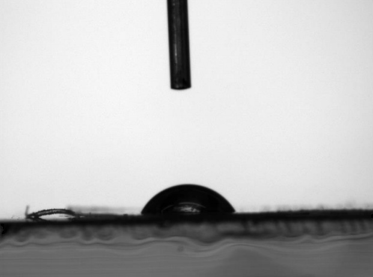
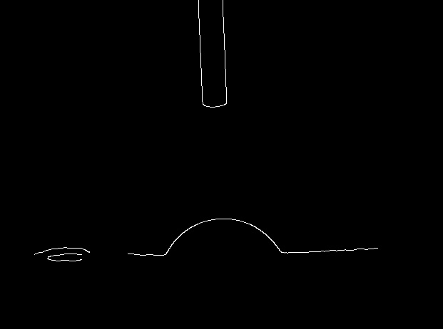
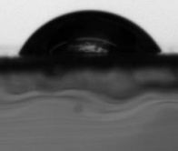
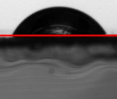
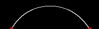
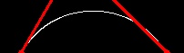
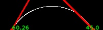

# Contanct-Angle
Determining Contact angle of a drop

Problem: The input is an image of a drop we want it's right and left angle
Solution:
1. Read in Gray Scale 

2. Edge Detection : Using Canny Algorithm

3. Crop : Using hough algorithm the finest circle(drop) will be detect and it will be cropped with a pad

4. Surface Detection : Using hough algorithm the largest line will be detected as surface

5. Under Surface Removal

6. Drop Contact Points Detection : the farest points on the surface will be considered as drop contact points

7. Tangent Lines Detection

8. Contact Angle Calculation: using tangent lines's slop angles is calculated

